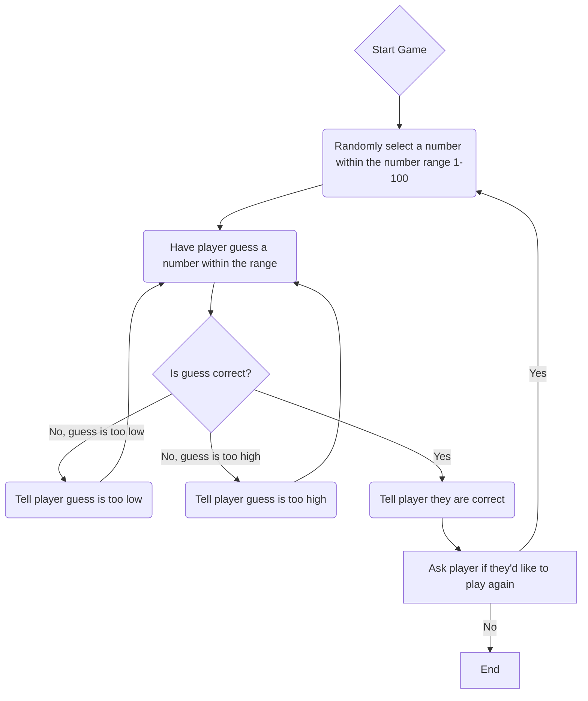

> The first step to the guessing game is pressing "start game". Once the player presses start, the computer will randomly select a number within the range provided. Once the player makes a guess, the computer will either tell the player their guess is too low, too high, or correct.
> If the players guess is too low or too high, the computer will let them know and will prompt them to try again. If the players guess is correct, the computer will tell them they are correct and will ask if they'd like to play again. If the player selects yes, the computer
> will randomly generate another number with the range and will start over. If the player selects no, the game will end.
